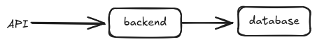
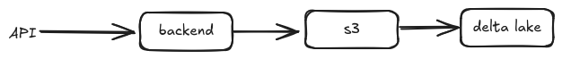

# deltalake-as-a-web-application-database

# Pre-requisites
1. node js
2. npm install -g serverless
3. aws configure

```bash
cd deltalake-as-a-web-application-database
python3 -m venv .venv
. .venv/bin/activate
pip install -r requirements.txt
npm i
sls deploy
```

Current state of standard applications



Using delta lake as database for an web application


